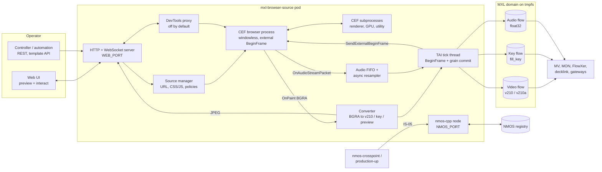

# mxl-browser-source — Specification

Status: v0.9 (implemented in this repository; spike results folded in, deviations in IMPLEMENTATION_PLAN.md)
Repository: `LeeO86/mxl-browser-source`
Sibling projects this spec aligns with: `LeeO86/mxl-multiviewer`, `LeeO86/mxl-test-player`, `LeeO86/mxl-webrtc-monitor`, `LeeO86/mxl-decklink`, and the platform meta repo `mmz-srf/mxl-poc-platform`
Functional inspiration: the OBS Browser Source and its "Interact" window (`obsproject/obs-browser`), the CasparCG HTML producer and its template API (`CasparCG/server`, `src/modules/html`)

The key words MUST, MUST NOT, SHOULD, SHOULD NOT and MAY are used as in RFC 2119.

The platform guideline G1–G14 (`mmz-srf/mxl-poc-platform`, `docs/requests/leeo86-v1-readiness.md`, "contract v1.0.0") and the follow-ups after the v1 releases (`docs/requests/leeo86-v1-followups.md`) apply in full. Where this document and the guideline disagree, the guideline wins; §20 lists every such conflict. Statements marked **(spike)** are not proven for the pinned CEF version and are settled by the spikes in §19 before the code depends on them.

---

## 1. Purpose and scope

`mxl-browser-source` renders one web page offscreen with the Chromium Embedded Framework (CEF) and writes it as MXL flows: a video flow (with an optional key), and an audio flow. It registers as an NMOS node, and its senders are routed with IS-05 like every other media function (nmos-crosspoint, the platform's production-up). An operator controls and interacts with the page from the function's web UI, like the "Interact" window of the OBS Browser Source: a live preview, mouse and keyboard on the page, URL, reload, CSS and JavaScript injection, zoom. A small HTTP API drives HTML graphics templates the way CasparCG does (`play`, `stop`, `next`, `update`).

Design principles:

1. **House time drives the page.** The function, not Chromium, decides when a frame is made: one external BeginFrame per MXL grain index (TAI), one grain per index. A page that is late never stalls MXL; the last frame is repeated and counted.
2. **No screen capture.** Windowless (offscreen) CEF only. No Xvfb, no VNC, no window grabbing **(spike S3 confirms no X server is needed)**.
3. **Standards on the control surface.** IS-04/IS-05 with BCP-007-03 (MXL transport) through nmos-cpp, a static registry, IP literals only.
4. **The siblings' conventions.** Settings, ports, health, metrics, shutdown, image tags and docs follow the multiviewer and the test player.
5. **Safe by default.** Interaction off until an operator turns it on, DevTools off, popups, downloads and permissions denied, a URL policy, no secrets in logs.
6. **Crash isolation.** One browser source per process and per pod (§2.3).

v1 scope and later stages:

| Item | v1 | Later |
| --- | --- | --- |
| Sources per process | 1 | – (more instances = more pods, §2.3) |
| Formats | progressive 720p50, 1080p25, 1080p29.97, 1080p50, 1080p59.94 | 1080i50/1080i59.94 (v1.1, §5.6); 2160p50/59.94 (stage 3, needs the GPU conversion path) |
| Key | `off`, `v210a`, `fill_key` | – |
| Audio | 0, 2, 8 or 16 channels, float32 48 kHz | – |
| Rendering | GPU (ANGLE on NVIDIA) and software | GPU shared texture without readback (§5.5) |
| Conversion | CPU, scalar reference + AVX2 | CUDA from a shared texture (stage 3) |
| Control | web UI, interaction WebSocket, REST, template API | IS-07 tally into the page; OBS-websocket/AMCP compatibility |
| Inputs | none | an MXL flow as page background or `<video>` source |

Out of scope: compressed outputs (route to mxl-webrtc-monitor or mxl-srt-gateway), user authentication beyond an optional token, DNS-SD, ST 2110 (route through mxl-st2110-gateway), recording.

## 2. Architecture

### 2.1 Overview



### 2.2 Components and threads

| Thread | Work | Must not |
| --- | --- | --- |
| main = CEF UI thread | `CefRunMessageLoop`; all `CefBrowserHost` calls (BeginFrame, input, navigation, zoom); CEF handlers (`OnPaint`, load, dialogs, popups) | block on MXL, disk or the network |
| tick (TAI) | sleeps to each grain index, commits grain k, posts the BeginFrame for k+1 to the UI thread, writes audio samples, watchdog | wait for CEF; it only takes what is ready |
| converter | BGRA copy → v210 fill, key plane or key flow, preview downscale | allocate per frame |
| audio (CEF's) | `OnAudioStreamPacket` → lock-free FIFO | resample or touch MXL |
| preview | JPEG of the downscaled frame at `BROWSER_PREVIEW_FPS` | run when no client watches |
| HTTP/WebSocket | UI, REST, interaction, events, DevTools proxy | call CEF directly (it posts tasks to the UI thread) |
| nmos-cpp | node, registration, IS-05 | – |

`OnPaint` copies the buffer (it is valid only during the call) into one of three BGRA buffers and returns. Only the newest complete paint is kept. Locks are never held across a CEF call, an MXL call or I/O. The tick thread runs `SCHED_FIFO` when `CAP_SYS_NICE` is granted, otherwise at normal priority with a one-time warning (as Strom does).

### 2.3 Process model and instances

- One process per browser source. The process starts CEF with a separate helper executable (`mxl-browser-source-helper`) as `browser_subprocess_path`, so renderers do not run the main binary's static initialisation (nmos-cpp, Boost). CEF spawns renderer, GPU and utility processes inside the container.
- **One pod (or one Compose service) per browser source.** Reasons: a renderer or GPU-process crash, a memory leak in a page, or a hung page affects only one output; each instance has its own NMOS node, readiness and restart; the scheduler and the GPU time-slicing count each instance; resource limits are per page. Cost: about 300–600 MB of RAM per instance for the CEF processes (to be measured), shared image layers.
- Alternatives, not chosen: (a) several `CefBrowser`s in one process — less memory, but one GPU-process crash or `CefShutdown` takes all outputs down, and the NMOS and readiness model gets one node for unrelated outputs; (b) one pod with several processes — isolation of processes but not of restarts, probes or limits.
- `mallinfo` shim: the Spotify CEF builds call the legacy `mallinfo()`, whose `int` fields overflow when a process passes 2 GiB and trip a Chromium `CHECK()` (seen as SIGILL, exit 132, after hours or weeks in Strom). The image MUST preload a shim that returns zeros (`LD_PRELOAD`, Strom `docker/gstcefsrc/mallinfo_shim.c`) and pass `--disable-features=BackgroundTracing`.

### 2.4 Timing model

Definitions: P is the grain period of the format, T(k) the TAI start of grain index k (`mxlGetNsUntilIndex`, `mxlIndexToTimestamp`), ε a scheduling margin (default 1 ms). Media-path time is TAI only; the UTC offset is never added or removed.

The tick thread runs once per index:

1. Sleep until T(k) + ε.
2. **Commit grain k.** If a paint arrived since the previous tick, the converter has produced its grain buffers; copy them into MXL grain k (`mxlFlowWriterOpenGrain`, all slices valid, `CommitGrain`) for the video flow, and the key flow in `fill_key`. If no paint arrived, commit the last converted frame again and count it: `repeated_grains_total{reason="late"}` for a ready page (unchanged or late), `{reason="hold"}` while the page is loading, crashed or hung (§13).
3. **Write audio** samples for the interval of grain k (§6).
4. **Request the next frame:** post one `SendExternalBeginFrame()` to the UI thread, on every tick (none while the renderer is gone).
5. If the thread woke after T(k+1), the indexes in between are committed as repeats and counted as `missed_grains_total` (the writer never leaves a gap in the ring).

Spike S2 (IMPLEMENTATION_PLAN.md §2) settled the BeginFrame semantics of CEF 144: one BeginFrame gives exactly one `OnPaint` when the page changed and none when it did not, and `Invalidate(PET_VIEW)` produces an immediate extra paint of the current frame. So there is no `Invalidate` per frame and no "outstanding BeginFrame" state: a static page never answers, which an outstanding rule would mistake for a stall. `Invalidate` is sent only after a load, a resize and a source change, so that a static page paints once.

Consequences:

- Exactly one BeginFrame per grain index. The page's `requestAnimationFrame` runs once per BeginFrame (spike S2: 1225 callbacks for about 1250 BeginFrames), so its timestamps and CSS animations advance in steps of P: animations are frame-locked to house time.
- Latency from the page state to MXL is one period (BeginFrame at about T(k−1), grain at T(k)) plus the conversion, plus the video delay of §6.
- **Late paint:** a paint that arrives after the tick of its grain is used at the next tick; the grain in between repeats the previous frame. Only the newest paint is kept, so a late page recovers on the next frame. A paint more than one period after its BeginFrame counts in `late_paints_total` (`paint_latency_seconds` has the distribution).
- `windowless_frame_rate` is set to the format's rate (rounded up); with `external_begin_frame_enabled` it only caps internal scheduling.
- 59.94/29.97 use the MXL rational rate; index arithmetic is MXL's (128-bit rounding as in the multiviewer).

### 2.5 Latency budget (1080p50, targets)

| Step | Budget |
| --- | --- |
| BeginFrame posted → `OnPaint` (GPU mode, typical graphics page) | ≤ 12 ms (p95) |
| `OnPaint` copy (8.3 MB) | ≤ 1 ms |
| Conversion BGRA → v210 + key (AVX2) | ≤ 2 ms on an i9-9900K |
| Commit into MXL | ≤ 1 ms |
| Operator click → visible in a grain | ≤ 150 ms on the lab network, including the WebSocket and one period |

## 3. Technology and build

- C++20, CMake ≥ 3.24, Ninja, GCC ≥ 12. Warnings `-Wall -Wextra`; a clean build is the lint signal.
- **CEF pin: `144.0.21+g4f5b28c+chromium-144.0.7559.248`**, Linux x64 "minimal" binary distribution from `cef-builds.spotifycdn.com`, checked against its published SHA-1 and a SHA-256 recorded in `IMPLEMENTATION_PLAN.md`. Why this version:
  1. It is the version Strom runs in containers on the lab hosts (LeeO86/strom `docker/gstcefsrc/Dockerfile`), with known workarounds (mallinfo shim, GPU-process flags, NSS CA import, cache cleanup). The siblings' experience applies directly.
  2. It is newer than CEF 124 (Chromium build 6367), whose accelerated-paint API reports dma-buf planes on Linux (`obs-browser` `browser-client.cpp` uses it behind `ENABLE_BROWSER_SHARED_TEXTURE`), so the later shared-texture stage needs no version jump.
  3. `external_begin_frame_enabled` and `SendExternalBeginFrame()` (no arguments) exist and are used by `obs-browser` (`BROWSER_EXTERNAL_BEGIN_FRAME_ENABLED`).
  - The pin is in exactly two places (`docker/Dockerfile` build arg and `.github/workflows/ci.yaml`, "keep in sync"). A CEF upgrade is its own pull request that passes the frame-accuracy, A/V, crash and soak tests (§17). Because pages are web content, CEF MUST be upgraded at least every three months for Chromium security fixes (§14).
  - The Spotify builds have no proprietary codecs: H.264/AAC in a page's `<video>` does not play; VP8/VP9/AV1/Opus do. Documented in the README.
- **MXL** `dmf-mxl/mxl` at `218ddaa0a08c12ffe75fc475ae65aa3d9eef16d7`, fetched by the full SHA (an abbreviated SHA broke FlowXer's release), `-DMXL_ENABLE_FABRICS_OFI=OFF`, built with vcpkg as in the multiviewer. Public C API only.
- **nmos-cpp** at `fe303849527394b03bdedc8f161f377fe458bb62`, as all siblings. No hand-built IS-04 JSON (the test player and the color corrector both failed the platform that way).
- Other libraries: libsamplerate (BSD-2-Clause, variable-ratio resampling), stb_image_write (JPEG preview, as the multiviewer), picojson, doctest. The HTTP and WebSocket server is the siblings' own small server (`src/ops/httpserver.*`).
- Web UI: Vue 3 + Vite, built into one HTML file and embedded in the binary (`cmake/EmbedFile.cmake`); no CDN.
- CPU target: the binary MUST run on x86-64-v2; AVX2 kernels live in their own translation units compiled with `-mavx2` and are chosen at runtime (bobi nodes have AVX2 only, the lab Xeon has AVX-512; Strom crashed with SIGILL after a CI build used AVX-512).
- Base images: `ubuntu:24.04` for build and runtime (CEF built for one Ubuntu release crashed on another in Strom).
- Layout: `src/{app,cef,config,convert,audio,mxlio,nmos,ops,ui,util}/`, `helper/`, `tests/{unit,integration,pages,tools,nmos}/`, `web/`, `deploy/`, `docker/`, `docs/`, `third_party/`.
- Licence: MIT (`LICENSE`), like seven of the nine siblings. `THIRD_PARTY_NOTICES.md` lists CEF (BSD-3-Clause), Chromium's third-party licences (`credits.html` from the CEF distribution, shipped in the image), the fonts, libsamplerate, stb.

## 4. Browser source

### 4.1 Source model

The source document (in `config.json`, §11) holds the page and its presentation:

| Field | Default | Meaning |
| --- | --- | --- |
| `url` | `https://templates.local/blank.html` | page to show |
| `background` | `transparent` | `transparent` or `#RRGGBB`; CEF `background_color` and the page background |
| `zoom` | `1.0` | page zoom factor (`SetZoomLevel(log(zoom)/log(1.2))`) |
| `device_scale_factor` | `1.0` | `GetScreenInfo`; the view rect is the raster divided by it |
| `css` | `""` | injected as a `<style>` element after every load (as obs-browser) |
| `js` | `""` | executed after every load |
| `user_agent_suffix` | `mxl-browser-source/<version>` | appended to Chromium's user agent |
| `reload_interval_s` | `0` | periodic reload, 0 = off |
| `audio` | `true` | capture the page's audio (false = silent flow) |
| `presets` | `[]` | named sets of the fields above, one click in the UI |

Changing the document through the UI or the API applies at once (navigation, injection, zoom) and is saved atomically. The raster size is the format's (§5.6); the page does not choose it.

### 4.2 Local templates

Files under `BROWSER_TEMPLATES_DIR` (default `/config/templates`) are served to the browser at `https://templates.local/…` by a CEF scheme handler (no network, no `file://`). The image ships `blank.html`, `bars.html` and the test pages of §17. `GET /api/v1/templates` lists the files. Upload through the UI is a later feature.

### 4.3 Page lifecycle

- Load: `OnLoadStart`, `OnLoadEnd` (inject CSS, then JS, then queued template calls), `OnLoadError` (state `error`, reason, `page_loads_total{result}`).
- While loading or in error, the output follows `BROWSER_ON_PAGE_ERROR`: `hold` (last frame, default), `transparent`, `black`, or `slate` (the built-in `error.html` with the reason).
- Navigation policy (§14.3) is checked in `OnBeforeBrowse` and for sub-resources in `OnBeforeResourceLoad`.
- Reload, stop, clear cache (`ExecuteDevToolsMethod("Network.clearBrowserCache")`, no open DevTools port needed) and clear cookies are API calls.

### 4.4 Template control (CasparCG style)

`POST /api/v1/template/{verb}` calls a function in the page's main frame with `CefFrame::ExecuteJavaScript`:

| Verb | Body | Call in the page |
| --- | --- | --- |
| `play` | – | `play()` |
| `stop` | – | `stop()` |
| `next` | – | `next()` |
| `update` | `{"data": <string or object>}` | `update(data)`; an object is passed as a JSON string, as CasparCG passes its template data string |
| `remove` | – | `remove()` if defined |
| `invoke` | `{"function": "name", "args": [...]}` | `name(...args)`; the name MUST match `^[A-Za-z_$][A-Za-z0-9_$.]*$` |

Calls before `OnLoadEnd` are queued and run after injection, in order (CasparCG does the same). Calls are fire-and-forget (HTTP 202); errors show up as console messages (`OnConsoleMessage`, `GET /api/v1/console`, `console_messages_total{level}`). A page MAY report results through `window.mxlBrowserSource.post(obj)` (a `CefMessageRouter` binding), which the function forwards as an `event` on `/api/v1/events`.

### 4.5 Popups, dialogs, downloads, permissions

| Event | Behaviour | Metric / event |
| --- | --- | --- |
| `window.open`, `target=_blank` (`OnBeforePopup`) | blocked (`BROWSER_POPUPS=block`, default) or opened in the same browser (`same_window`) if the URL passes the policy | `popups_blocked_total`, UI event |
| `alert` (`OnJSDialog`) | dismissed at once | `js_dialogs_total{type="alert"}`, UI event with the text |
| `confirm` | answered with `BROWSER_CONFIRM_DIALOGS` (`cancel` default, `accept`) | same |
| `prompt` | cancelled | same |
| `beforeunload` | leave allowed | same |
| downloads (`CanDownload`) | denied | `downloads_blocked_total` |
| camera, microphone, geolocation, notifications, clipboard read, MIDI (`OnRequestMediaAccessPermission`, `OnShowPermissionPrompt`) | denied | `permission_denied_total{type}` |
| file chooser (`OnFileDialog`) | cancelled | event |
| context menu | empty model | – |
| print | ignored | – |

No dialog ever waits for an operator: the output MUST NOT stall on a modal.

## 5. Video pipeline

### 5.1 Paint path

v1 uses `OnPaint` (CPU BGRA buffer), also in GPU mode, where Chromium rasterises and composites on the GPU and reads the frame back. Decision and reasons:

- Linux shared textures arrive as dma-buf planes with DRM modifiers. Importing them into CUDA needs EGL interop (`EGLImage` → `cuGraphicsEGLRegisterImage`), and `obs-browser` already needs a workaround for invalid modifiers under X11. That path is not proven on NVIDIA A4000/L4 with this CEF version and becomes stage 3 after a spike (S5).
- The siblings' fastest proven conversion is on the CPU (color corrector: whole v210 path in AVX2, 0.7 ms per 1080p frame on a CI runner, bit-exact). The paint already is in CPU memory, so CUDA would add an upload and a download over PCIe (the A16 lab GPUs have only a x4 link).
- 1080p50 BGRA is 415 MB/s of readback, well within the budget; 2160p50 (1.66 GB/s plus conversion) is the reason the shared-texture path exists as stage 3.

### 5.2 Colour conversion

- Input: 8-bit BGRA, **premultiplied** alpha as delivered by CEF **(spike S2 confirms)**, sRGB-encoded R'G'B' treated as BT.709 R'G'B' (no linearisation, as broadcast graphics systems do).
- Fill:
  - `key_mode=off`: the page composited over `background` (premultiplied values over black when transparent).
  - `key_mode=v210a` or `fill_key`: **straight** fill by default (`BROWSER_FILL=straight`: c = min(255, round(c·255/a)) for a > 0, 0 for a = 0), `premultiplied` selectable (shaped fill). Straight is the convention of the test player and the multiviewer.
- Matrix BT.709, limited range, 10 bit: Y' = 0.2126 R' + 0.7152 G' + 0.0722 B'; Cb = (B' − Y')/1.8556; Cr = (R' − Y')/1.5748; Y10 = 64 + 876·Y', C10 = 512 + 896·C, rounded half away from zero, clamped to 4…1019 (v210 reserves 0–3 and 1020–1023).
- 4:2:2: chroma co-sited with the even pixel, low-pass `[1 2 1]/4` over the full-resolution chroma (edges clamped), computed in fixed point.
- The scalar reference (`src/convert/reference.cpp`) defines every rounding; the AVX2 kernels MUST produce identical bytes (unit tests on rasters 6…3840 px wide, all key modes, random and edge values), as in the color corrector.
- Colorimetry in the flow definition: `BT709`, transfer `SDR`, limited range.

### 5.3 v210 and key formats

- v210: 6 pixels per 16 bytes, row stride `ceil(width/48)·128` bytes (the webrtc-monitor read 1280-wide sources with the wrong stride until 1.0.1).
- `v210a`: the v210 fill plane followed by a 10-bit alpha plane, three samples per 32-bit word, `ceil(width/3)·4` bytes per line, full range 0…1023 (A10 = round(a·1023/255)), straight; flow `media_type` `video/v210a` with component `{"name":"A","bit_depth":10}`. The layout is the one mxl-decklink writes and mxl-multiviewer reads.
- `fill_key`: two `video/v210` flows. The key flow carries alpha as luma, legal range (Y10 = round(64 + 876·a/255), Cb = Cr = 512). Fill and key are written with the same grain index in the same tick.
- tmpfs cost (200 ms history, 1080p50): v210 53 MB, v210a 85 MB, fill_key 106 MB.

### 5.4 Frame repeat and hold

The last converted grain buffers are kept. A repeat copies them into the new grain; nothing is converted again. During `hold` (§4.3, §13) the output keeps that frame; `transparent`, `black` and `slate` replace it.

### 5.5 Render modes (GPU and software)

`BROWSER_RENDER=auto|gpu|software` (default `auto`):

- `gpu`: Chromium with ANGLE on the NVIDIA GPU. CEF 144 rejects `--use-gl=egl` (Strom). Spike S1 chose ANGLE on EGL without X: `--ozone-platform=headless --use-gl=angle --use-angle=gl-egl --enable-gpu-rasterization --ignore-gpu-blocklist`, with the glvnd vendor file `10_nvidia.json` in the image (the container toolkit injects the library but not the file; without it EGL silently falls back to llvmpipe). ANGLE on Vulkan rendered, but answered 29 of 1000 BeginFrames with no or two paints.
- `software`: `--disable-gpu --disable-gpu-compositing --use-gl=disabled` (with `--disable-gpu` alone Chromium still starts a GPU process that probes the driver and crashed in Strom). Documented fallback, not normal operation: it costs CPU per animated page and is the mode for hosts without a GPU and for CI.
- `auto`: `gpu` when a GPU is visible (`/dev/nvidia*` and `libcuda`/`libEGL_nvidia` load), else `software` with the warning `render_software_fallback` and the metric `render_mode{mode="software"} 1`.
- The process MUST report the mode Chromium really uses, not only the requested one. `SystemInfo.getInfo` belongs to the browser target, which `ExecuteDevToolsMethod` does not reach; after the first load the process asks the page instead (`Runtime.evaluate` of WebGL's unmasked renderer string): no WebGL, SwiftShader or llvmpipe is `software`, anything else `gpu`. GPU requested and software found is `render_degraded`.
- Target hardware: NVIDIA RTX A4000 (small platform) and L4 (fat platform); the lab's A16 is the interim test GPU.

### 5.6 Formats

`BROWSER_FORMAT` (default `1080p50`): `720p50`, `1080p25`, `1080p29.97`, `1080p50`, `1080p59.94` in v1. A format change needs a restart and gives new flow ids (§8).

- **1080i50 (v1.1):** MXL interlaced grains are fields (the flow declares `grain_rate` 25/1 with `interlaced_tff` and the SDK doubles it, as the test player found). The source renders one BeginFrame per field (50 per second, so motion is truly interlaced), takes the even lines of frame 2n for the top field and the odd lines of frame 2n+1 for the bottom field, and MAY apply a vertical `[1 2 1]/4` filter (`BROWSER_INTERLACE_FILTER`, against twitter on thin graphics). Key the same way.
- **2160p50 (stage 3):** after the shared-texture path and a CUDA conversion are measured on an L4; until then 2160p is refused with exit 78.

## 6. Audio pipeline

- `CefAudioHandler::GetAudioParameters` asks for 48 kHz, the channel layout of `BROWSER_AUDIO_CHANNELS` (2 = stereo default, 8, 16; 0 = no audio flow) and 10 ms buffers. `OnAudioStreamStarted`, `OnAudioStreamPacket` (planar float, `pts` in ms), `OnAudioStreamStopped`, `OnAudioStreamError`. `SetAudioMuted` is not used: in windowless mode the handler receives the audio instead of a device. Autoplay without a gesture is allowed (`--autoplay-policy=no-user-gesture-required`).
- Chromium's audio clock is not PTP: packets arrive at Chromium's rate, which drifts against TAI. Packets go into a FIFO; the tick thread takes exactly the samples for its grain interval through a **variable-ratio resampler** (libsamplerate, `SRC_SINC_MEDIUM_QUALITY`). A PI controller holds the FIFO fill at `BROWSER_AUDIO_BUFFER_MS` (default 60 ms) by adjusting the ratio within ±500 ppm. Metrics: `audio_drift_ppm` (the controller's ratio), `audio_buffer_seconds` (fill), `audio_underruns_total` (silence inserted), `audio_overruns_total` (samples dropped), `audio_resets_total` (fill out of range → FIFO reset to the target).
- Output: MXL continuous flow, `audio/float32`, 48 kHz, the configured channel count, planar, written by sample index derived from TAI (`mxlFlowWriterOpenSamples`/`CommitSamples`; two fragments on a ring wrap). 1080p50 writes 960 samples per tick; 59.94 alternates by the exact sample index of T(k).
- Channel mapping: page channels beyond the flow's count are dropped, missing ones are silent (the multiviewer's rule). A stereo page into an 8-channel flow fills channels 1–2.
- **Silence:** with no stream (no audio element, stream stopped, page loading or crashed, `audio=false`) the flow carries zeros at the same cadence; the flow never stops while the sender is enabled.
- **A/V alignment:** video reaches MXL one period (`BROWSER_FRAME_LEAD`) after the page state; audio after the FIFO target plus Chromium's buffer. The video is delayed by whole grains (`BROWSER_VIDEO_DELAY_GRAINS`, default `auto` = round((audio latency − video latency)/P), ≥ 0) and audio is trimmed by `BROWSER_AV_OFFSET_MS` (default 0, positive delays audio). Target: |offset| ≤ 1 frame, measured with the A/V test page (§17). Spike S4: packets are 480 frames (10 ms) and their `pts` follows `CLOCK_MONOTONIC` exactly, so a stream starts from an empty FIFO that fills to the target before samples are taken (silence until then); the packet `pts` is not needed to place samples.

## 7. Interaction and preview

### 7.1 Model

- Interaction is **off** by default. An operator enables it per UI session ("Interact" toggle). At most one session controls the page; others observe. A session can take control explicitly (`take: true`); the previous controller is told.
- Control ends on toggle off, on disconnect, or after `BROWSER_INTERACT_TIMEOUT_S` (default 120) without input. The UI shows a red "INTERACT — ON AIR" frame while it controls the page.
- Input from a session without control is rejected with an `error` message and counted.
- Coordinates are normalised (0…1 of the preview image) and scaled to view pixels: x_view = x · width / device_scale_factor (the same for y). The preview has the raster's aspect ratio, so no letterbox math is needed.
- Injection on the UI thread: `SendMouseMoveEvent`, `SendMouseClickEvent` (button, up/down, click count), `SendMouseWheelEvent` (pixel deltas), `SendKeyEvent`, `SetFocus`, `ImeSetComposition`, `ImeCommitText`, `ImeFinishComposingText`, `ImeCancelComposition`.
- Keys follow obs-browser: a key press is `KEYEVENT_RAWKEYDOWN` (with `windows_key_code` from a table of DOM `code` → Windows virtual key, and modifiers), then `KEYEVENT_CHAR` with `character` when the key produces text and no Ctrl/Meta is held, then `KEYEVENT_KEYUP`. Shortcuts (Ctrl+A, Ctrl+C, Ctrl+V, Ctrl+Z) are key events with modifiers; Chromium's editing commands handle them. Clipboard paste uses the container's clipboard, which is empty: text is sent with `text` messages instead. Text and IME commit become `CHAR` events or `ImeCommitText`.
- The UI captures keyboard events while it controls the page and calls `preventDefault()`. Shortcuts the operator's own browser reserves (for example Ctrl+W) cannot be captured; the UI documents this.
- `OnCursorChange` is forwarded so the preview shows the page's cursor.

### 7.2 WebSocket protocol

Endpoint `GET /api/v1/interact` (WebSocket) on `WEB_PORT`. Text frames are JSON; binary frames carry preview images.

Client → server (JSON Schema, draft 2020-12, abbreviated; the full schema is `docs/interact.schema.json`):

```json
{
  "oneOf": [
    {"type": "object", "required": ["type"], "properties": {
      "type": {"const": "hello"}, "client": {"type": "string"}, "protocol": {"const": 1}}},
    {"type": "object", "required": ["type", "enable"], "properties": {
      "type": {"const": "interact"}, "enable": {"type": "boolean"}, "take": {"type": "boolean"}}},
    {"type": "object", "required": ["type", "action", "x", "y"], "properties": {
      "type": {"const": "pointer"},
      "action": {"enum": ["move", "down", "up", "leave"]},
      "x": {"type": "number", "minimum": 0, "maximum": 1},
      "y": {"type": "number", "minimum": 0, "maximum": 1},
      "button": {"enum": ["left", "middle", "right"]},
      "clicks": {"type": "integer", "minimum": 1, "maximum": 3},
      "modifiers": {"$ref": "#/$defs/modifiers"}, "seq": {"type": "integer"}}},
    {"type": "object", "required": ["type", "x", "y", "dx", "dy"], "properties": {
      "type": {"const": "wheel"}, "x": {"type": "number"}, "y": {"type": "number"},
      "dx": {"type": "number"}, "dy": {"type": "number"},
      "modifiers": {"$ref": "#/$defs/modifiers"}, "seq": {"type": "integer"}}},
    {"type": "object", "required": ["type", "action", "code"], "properties": {
      "type": {"const": "key"}, "action": {"enum": ["down", "up"]},
      "code": {"type": "string", "description": "KeyboardEvent.code, e.g. KeyA"},
      "key": {"type": "string", "description": "KeyboardEvent.key, e.g. a"},
      "repeat": {"type": "boolean"}, "modifiers": {"$ref": "#/$defs/modifiers"}, "seq": {"type": "integer"}}},
    {"type": "object", "required": ["type", "text"], "properties": {
      "type": {"const": "text"}, "text": {"type": "string", "maxLength": 4096}}},
    {"type": "object", "required": ["type", "action"], "properties": {
      "type": {"const": "ime"}, "action": {"enum": ["composition", "commit", "finish", "cancel"]},
      "text": {"type": "string"}, "selection": {"type": "array", "items": {"type": "integer"}, "maxItems": 2}}},
    {"type": "object", "required": ["type", "focused"], "properties": {
      "type": {"const": "focus"}, "focused": {"type": "boolean"}}},
    {"type": "object", "required": ["type"], "properties": {
      "type": {"const": "preview"}, "fps": {"type": "integer", "minimum": 1, "maximum": 25},
      "width": {"type": "integer", "minimum": 160, "maximum": 1920}}}
  ],
  "$defs": {"modifiers": {"type": "array", "items": {"enum": ["shift", "ctrl", "alt", "meta", "capslock"]}, "uniqueItems": true}}
}
```

Server → client:

| `type` | Fields | When |
| --- | --- | --- |
| `state` | `interact` {`enabled`, `controller`: `self`/`other`/`none`, `expires_in_s`}, `page` {`url`, `title`, `loading`, `error`}, `render` {`mode`, `format`} | on connect and on change |
| `ack` | `seq`, `grain` (first grain index that can show the effect) | after each input with `seq`, for latency measurement |
| `cursor` | `cursor` (CSS cursor name) | `OnCursorChange` |
| `dialog` | `kind`, `message`, `result` | §4.5 |
| `console` | `level`, `message`, `source`, `line` | page console (rate-limited) |
| `error` | `code`, `message` | rejected input, policy violations |
| binary | 8-byte little-endian grain index, then a JPEG | preview frames |

Limits: 200 input messages per second per session, 64 KiB per message; beyond that the server drops messages and counts them. Malformed messages get an `error` and are ignored.

### 7.3 Preview

The siblings preview with low-rate JPEG (multiviewer `/preview.jpg` at 5 fps and 480 px, test player thumbnail encoded on request). The browser source keeps that mechanism and adds a push path for interaction:

- `GET /api/v1/preview.jpg`: the newest converted frame, encoded on request (cached for one preview period).
- Preview frames over the interaction WebSocket at `BROWSER_PREVIEW_FPS` (default 10, up to 25 while the session controls the page) and `BROWSER_PREVIEW_WIDTH` (default 960). Polling a JPEG adds a round trip per frame; a push keeps the click-to-picture time short. WebRTC is not used: full-rate monitoring is mxl-webrtc-monitor's job (route the video flow to it).
- The preview is made from the BGRA frame (downscaled box filter, composited over a checkerboard in the UI when transparent), so it costs nothing when no client watches.

## 8. NMOS

### 8.1 Node and resources

nmos-cpp at the pinned commit, as in the multiviewer.

- Node: label `NMOS_LABEL` (default `MXL Browser Source`), tags from `NMOS_TAGS`, `href` and `api.endpoints` on `NMOS_HOST_ADDRESS:NMOS_PORT`.
- Device `urn:x-nmos:device:generic`, label `NMOS_LABEL`, tags `NMOS_TAGS`, and the control `urn:x-nmos:control:sr-ctrl/v1.1` with href `http://NMOS_HOST_ADDRESS:NMOS_PORT/x-nmos/connection/v1.1/`. The platform finds a sender's Connection API only through this control (the color corrector 1.0.1 lacked it and could not be connected).
- Sources, flows and senders (transport `urn:x-nmos:transport:mxl`, BCP-007-03):

| Output | Exists when | Flow | Sender label | Group hint |
| --- | --- | --- | --- | --- |
| Video | always | `video/v210` (`video/v210a` in `v210a`) | `<BROWSER_LABEL> Video` | `<BROWSER_LABEL>:Video` |
| Key | `key_mode=fill_key` | `video/v210` (alpha as luma) | `<BROWSER_LABEL> Key` | `<BROWSER_LABEL>:Key` |
| Audio | `BROWSER_AUDIO_CHANNELS > 0` | `audio/float32`, 48 kHz | `<BROWSER_LABEL> Audio` | `<BROWSER_LABEL>:Audio` |

`BROWSER_LABEL` defaults to `Browser`. Sender labels are unique within the node because the platform connects by label. No receivers in v1.

- Ids (UUIDv5, namespace = UUIDv5(nil, `mxl-browser-source`), name = `NMOS_SEED` + `/` + item):

| Item | Name suffix |
| --- | --- |
| node | `node` |
| device | `device` |
| sources | `source/video`, `source/key`, `source/audio` |
| flows | `flow/video/<format>/<key_mode>`, `flow/key/<format>`, `flow/audio/<channels>` |
| senders | `sender/video`, `sender/key`, `sender/audio` |
| default output domain id | `domain` |

A format or key-mode change gives new flow ids (MXL flow definitions differ); senders keep theirs.

### 8.2 IS-05

- Senders report the active `mxl_domain_id` and `mxl_flow_id` (BCP-007-03); the constraints enumerate exactly those values.
- `master_enable: false` stops committing grains (and samples) of that flow; the flow stays in the domain and readers see no new grains. `true` resumes at the current index. Senders start enabled.
- The enable state persists in `/config/state.json` and is restored on start (G9 SHOULD); the active document matches what is written.

### 8.3 Registry

Static registry (`NMOS_REGISTRY_ADDRESS`, `NMOS_REGISTRY_PORT`), Query API (`NMOS_QUERY_ADDRESS`, `NMOS_QUERY_PORT`, default registry address and port + 1), `NMOS_DNS_SD=false` by default (nmos-cpp `pri`/`highest_pri` = `INT_MAX`; no Avahi or D-Bus needed). VideoIPath does not use mDNS and never sees MXL resources; the registry URL is always configured. Readiness requires the node to be visible on the Query API.

nmos-cpp swallows listener errors (`server.cpp` `open_listeners`): after the node starts, the process MUST check that it owns a socket listening on `NMOS_PORT` (`/proc/net/tcp{,6}` and `/proc/self/fd`, as the ST 2110 and SRT gateways do) and exit 75 otherwise.

## 9. Domains and MXL I/O

- `MXL_DOMAIN_SCAN_PATH` (default `/Volumes/mxl`) is the MXL root. **It MUST be a tmpfs:** at start the process checks it with `statfs` (`TMPFS_MAGIC`). If it is missing or not a tmpfs, the process logs `mxl_root_not_tmpfs` with the path and the fix ("mount a tmpfs at … or set BROWSER_REQUIRE_TMPFS=false for tests") and exits 78. `BROWSER_REQUIRE_TMPFS=false` is for CI and unit tests only.
- Own domain: `MXL_OUTPUT_DOMAIN_DIR` (default `<scan path>/browser-source-<seed>`) with `MXL_OUTPUT_DOMAIN_ID` (default the UUIDv5 above). Created with `domain_def.json` and `options.json` (`urn:x-mxl:option:history_duration/v1.0` = `MXL_HISTORY_DURATION_NS`, default 200 ms) only when missing; never rewritten. An existing `domain_def.json` with another id is logged (`domain_id_mismatch`) and kept, and NMOS announces that id (test player 1.0.2). The process never writes into another domain or a mirror (`x-mxl-fabrics-agent.mirror`).
- Writers: one per flow, opened at start and kept; flow definitions carry label, group hint and colorimetry. `mxlGarbageCollectFlows` once at start.
- MXL keeps one file descriptor per grain: the process raises `RLIMIT_NOFILE` soft to hard at start (test player, SRT gateway and fabrics agent all hit Docker's 1024).
- `MXL_CLEANUP_ON_EXIT=true` removes the own domain on SIGTERM (after the writers are closed); default `false`, the platform sets `true` for productions.

## 10. Web UI and HTTP API

### 10.1 Ports and paths

| Port | Setting | Default | Serves |
| --- | --- | --- | --- |
| web | `WEB_PORT` | 8160 | UI `/`, REST `/api/v1/…`, WebSockets, `/livez`, `/readyz`, `/statusz`, `/metrics`, `/devtools/…` |
| NMOS | `NMOS_PORT` | 3312 | `/x-nmos/node/v1.3`, `/x-nmos/connection/v1.1` |
| NMOS WebSocket | `NMOS_PORT`+1 | 3313 | reserved for nmos-cpp |
| DevTools (internal) | `BROWSER_DEVTOOLS_PORT` | 9222 | bound to 127.0.0.1 only, never exposed |

The ports were reserved with the platform (`SPECIFICATION.md` §12.2: "browser-source 8160, 3312/3313 (planned)"). Two instances on one host work with distinct values; a port that cannot be bound exits 75.

### 10.2 Pages

- **Source:** large preview, Interact toggle with the on-air frame, URL field with go/reload/stop, clear cache, presets, background, zoom and device scale, CSS and JS editors, page state, console messages, dialog events.
- **Template:** play/stop/next/remove, an `update` data editor (JSON or text), invoke.
- **Settings:** the settings table of §11 with "restart required" markers, export and import buttons.
- **Status:** render mode, grains/repeats/late paints, paint latency, audio meters and drift, NMOS ids and sender states, DevTools switch (when allowed).

The UI MUST work inside an iframe (no `X-Frame-Options: DENY`): the platform's production designer embeds function UIs.

### 10.3 REST

| Method | Path | Purpose |
| --- | --- | --- |
| GET | `/api/v1/info` | version, CEF/Chromium version, MXL revision, nmos-cpp pin, render mode, format |
| GET | `/api/v1/status` | page, render, grains, audio, interaction, NMOS |
| GET, PUT, PATCH | `/api/v1/source` | source document (§4.1); applies at once |
| POST | `/api/v1/source/navigate` | `{"url": …}` |
| POST | `/api/v1/source/reload` | `{"ignore_cache": false}` |
| POST | `/api/v1/source/stop` | stop loading |
| POST | `/api/v1/source/clear-cache` | HTTP cache; `{"cookies": true}` also clears cookies |
| POST | `/api/v1/source/execute` | `{"js": …}` run JavaScript in the page (logged with the caller address) |
| GET, POST, DELETE | `/api/v1/presets[/{name}]` | presets; `POST /api/v1/presets/{name}/apply` |
| POST | `/api/v1/template/{verb}` | §4.4 |
| GET | `/api/v1/templates` | local template files |
| GET | `/api/v1/console` | last 200 console messages |
| GET | `/api/v1/preview.jpg` | §7.3 |
| GET | `/api/v1/nmos` | node, device, flow and sender ids, enable states |
| GET, PUT | `/api/v1/config` | settings (§11); `null` removes a key from the file |
| GET | `/api/v1/config/env` | effective settings as `KEY=value` |
| GET | `/api/v1/config/export` | one document: settings, source, presets, sender enable states |
| POST | `/api/v1/config/import` | the same document; returns `restart_required` keys |
| GET | `/api/v1/events` | WebSocket: state, meters, dialogs, page events (4 Hz) |
| GET | `/api/v1/interact` | WebSocket: §7.2 |
| GET | `/devtools/…` | §10.4 |

With `BROWSER_API_TOKEN` set, every `/api/v1/…` and `/devtools/…` request needs `Authorization: Bearer <token>` (the UI asks once). Empty (default) means no token: on the platform the ingress has no authentication and the decision is the platform's (FlowXer runs without a token there, D-092).

### 10.4 DevTools

- Off by default (`BROWSER_DEVTOOLS=false`). When on, CEF's `remote_debugging_port` listens on 127.0.0.1:`BROWSER_DEVTOOLS_PORT` only, with `--remote-allow-origins` set to the function's own origin.
- The function proxies `/devtools/json/list`, `/devtools/json/version`, the DevTools frontend and the page WebSocket under `/devtools/`, rewriting `webSocketDebuggerUrl` and `devtoolsFrontendUrl` to the proxied path, so DevTools works through the ingress without exposing the port.
- DevTools gives full control of the page and its network. While a DevTools session is connected, the UI shows a banner, the metric `devtools_sessions` is 1, and each connect is logged with the client address. Turning DevTools on or off needs a restart (CEF settings are fixed at `CefInitialize`).

### 10.5 Ops

- `/livez`: the process and the CEF message loop answer (a UI-thread task completes within 2 s).
- `/readyz`: 200 when the browser exists, the writers are open and, with a registry configured, the node is on the Query API. A page that fails to load does not make the function unready (the output holds); a CEF that cannot start does.
- `/statusz`: human-readable summary.
- `/metrics`: §12.

## 11. Configuration

Precedence: environment > `BROWSER_CONFIG_FILE` (default `/config/config.json`) > defaults. Unknown environment variables are ignored (CI exports `NMOS_CPP_REF`, which once made the multiviewer exit 78). An invalid value exits 78 with the key and the reason; values are never logged when a key is marked secret.

The file is one JSON document, written atomically by the UI and the API (`tmp` + `rename`) and readable by hand:

```json
{
  "version": 1,
  "settings": {
    "BROWSER_FORMAT": "1080p50",
    "BROWSER_KEY_MODE": "v210a",
    "BROWSER_AUDIO_CHANNELS": "2",
    "BROWSER_PREVIEW_FPS": "10"
  },
  "source": {
    "url": "https://templates.local/lower-third/index.html",
    "background": "transparent",
    "zoom": 1.0,
    "device_scale_factor": 1.0,
    "css": "body { margin: 0; }",
    "js": "",
    "reload_interval_s": 0,
    "audio": true
  },
  "presets": [
    {"name": "Bars", "url": "https://templates.local/bars.html", "background": "#000000"},
    {"name": "Scoreboard", "url": "https://graphics.media.int/scoreboard/", "css": "", "js": ""}
  ],
  "senders": {"video": true, "key": true, "audio": true}
}
```

`settings` holds strings with the environment names; `source`, `presets` and `senders` are the live documents. Changes through the UI or the API to `source`, `presets` and `senders` apply at once; changes to settings marked "Restart" apply on the next start and are reported as `restart_required`. **A hand edit of the file is read only at start: restart the service after editing it.** Export and import (`/api/v1/config/export`, `/import`, buttons in the UI) use the same document; `BROWSER_API_TOKEN` is never exported.

| Key | Default | Restart | Meaning |
| --- | --- | --- | --- |
| `WEB_PORT` | 8160 | yes | web port |
| `NMOS_PORT` | 3312 | yes | NMOS APIs; `NMOS_PORT`+1 reserved |
| `NMOS_SEED` | hostname | yes | seed of all UUIDv5 ids |
| `NMOS_LABEL` | `MXL Browser Source` | yes | node and device label |
| `NMOS_TAGS` | `{}` | yes | JSON tags on node and device |
| `NMOS_REGISTRY_ADDRESS` / `_PORT` | empty / 3210 | yes | static registry (platform: 8010) |
| `NMOS_QUERY_ADDRESS` / `_PORT` | registry / registry+1 | yes | Query API for readiness |
| `NMOS_DNS_SD` | `false` | yes | DNS-SD browse and advertisement |
| `NMOS_HOST_ADDRESS` | first non-loopback IPv4 | yes | the only address ever announced (IP literal) |
| `MXL_DOMAIN_SCAN_PATH` | `/Volumes/mxl` | yes | MXL root, must be tmpfs |
| `MXL_OUTPUT_DOMAIN_DIR` | `<root>/browser-source-<seed>` | yes | own domain |
| `MXL_OUTPUT_DOMAIN_ID` | UUIDv5 `domain` | yes | own domain id |
| `MXL_HISTORY_DURATION_NS` | 200000000 | yes | ring history, written once |
| `MXL_CLEANUP_ON_EXIT` | `false` | no | remove the own domain on SIGTERM |
| `SHUTDOWN_TIMEOUT_S` | 10 | no | SIGTERM budget |
| `LOG_LEVEL` / `LOG_FORMAT` | `info` / `json` | no | logging (JSON lines to stderr) |
| `BROWSER_STATE_DIR` | `/config` | yes | all state: config, state, templates, profile |
| `BROWSER_CONFIG_FILE` | `<state>/config.json` | yes | the document above |
| `BROWSER_LABEL` | `Browser` | yes | sender label prefix and group hint |
| `BROWSER_FORMAT` | `1080p50` | yes | §5.6 |
| `BROWSER_KEY_MODE` | `off` | yes | `off`, `v210a`, `fill_key` |
| `BROWSER_FILL` | `straight` | yes | `straight` or `premultiplied` fill with a key |
| `BROWSER_AUDIO_CHANNELS` | 2 | yes | 0, 2, 8, 16 |
| `BROWSER_AUDIO_BUFFER_MS` | 60 | yes | FIFO target |
| `BROWSER_AV_OFFSET_MS` | 0 | no | audio trim, positive delays audio |
| `BROWSER_VIDEO_DELAY_GRAINS` | `auto` | yes | §6 |
| `BROWSER_FRAME_LEAD` | 1 | yes | video latency in periods that `BROWSER_VIDEO_DELAY_GRAINS=auto` assumes (1–2); a paint is always committed at the first tick after it arrives |
| `BROWSER_RENDER` | `auto` | yes | `auto`, `gpu`, `software` |
| `BROWSER_ON_PAGE_ERROR` | `hold` | no | `hold`, `transparent`, `black`, `slate` |
| `BROWSER_HANG_TIMEOUT_MS` | 3000 | no | the renderer does not answer a liveness probe for this long → hang (§13) |
| `BROWSER_MAX_RESIDENT_MB` | 0 | no | CEF processes' memory warning threshold, 0 = off (§13) |
| `BROWSER_POPUPS` | `block` | no | `block`, `same_window` |
| `BROWSER_CONFIRM_DIALOGS` | `cancel` | no | `cancel`, `accept` |
| `BROWSER_URL_ALLOW` / `_DENY` | empty / §14.3 | no | URL policy lists |
| `BROWSER_PREVIEW_FPS` / `_WIDTH` | 10 / 960 | no | preview |
| `BROWSER_INTERACT_TIMEOUT_S` | 120 | no | control ends after this idle time |
| `BROWSER_DEVTOOLS` | `false` | yes | DevTools proxy |
| `BROWSER_DEVTOOLS_PORT` | 9222 | yes | internal DevTools port (loopback) |
| `BROWSER_API_TOKEN` | empty | yes | optional bearer token (secret) |
| `BROWSER_PROFILE` | `ephemeral` | yes | `ephemeral` (cache in `/tmp`, cleared at start) or `persistent` (`<state>/profile`, cookies and logins survive) |
| `BROWSER_TEMPLATES_DIR` | `<state>/templates` | yes | §4.2 |
| `BROWSER_FONTS_DIR` | `<state>/fonts` | yes | extra fonts, added to fontconfig at start |
| `BROWSER_CA_DIR` | `/etc/mxl-browser-source/ca` | yes | PEM files imported into the NSS database at start |
| `HTTPS_PROXY` / `HTTP_PROXY` / `NO_PROXY` | empty | yes | passed to Chromium as `--proxy-server` and `--proxy-bypass-list` |
| `BROWSER_REQUIRE_TMPFS` | `true` | yes | §9; `false` only for tests |
| `BROWSER_CHROMIUM_FLAGS_APPEND` | empty | yes | extra Chromium switches (expert; appended, never replacing the function's own) |

## 12. Metrics

Prefix `mxl_browser_source_`. Durations in seconds with millisecond buckets.

| Metric | Type | Labels |
| --- | --- | --- |
| `info` | gauge | `version`, `cef`, `chromium`, `mxl_revision`, `format`, `key_mode` |
| `render_mode` | gauge | `mode` (`gpu`, `software`) |
| `render_degraded` | gauge | – (1 when GPU mode was requested but Chromium composites in software) |
| `grains_total` | counter | `flow` (`video`, `key`) |
| `repeated_grains_total` | counter | `reason` (`late`, `hold`) |
| `missed_grains_total` | counter | – |
| `begin_frames_total` | counter | – |
| `late_paints_total` | counter | – (paints more than one period after their BeginFrame) |
| `paint_latency_seconds` | histogram | – (BeginFrame posted → `OnPaint`) |
| `convert_seconds` | histogram | – |
| `commit_lateness_seconds` | histogram | – (commit time − T(k)) |
| `audio_samples_total` | counter | – |
| `audio_underruns_total`, `audio_overruns_total`, `audio_resets_total` | counter | – |
| `audio_drift_ppm` | gauge | – |
| `audio_buffer_seconds` | gauge | – |
| `audio_peak_dbfs` | gauge | `channel` |
| `page_state` | gauge | `state` (`loading`, `loaded`, `error`, `crashed`, `hung`) |
| `page_loads_total` | counter | `result` (`ok`, `error`, `blocked`) |
| `page_load_seconds` | histogram | – |
| `renderer_crashes_total` | counter | `reason` |
| `gpu_process_crashes_total` | counter | – |
| `page_hangs_total` | counter | – |
| `js_dialogs_total` | counter | `type` |
| `popups_blocked_total`, `downloads_blocked_total` | counter | – |
| `permission_denied_total` | counter | `type` |
| `navigation_blocked_total` | counter | `reason` |
| `console_messages_total` | counter | `level` |
| `interact_sessions` | gauge | – (controlling sessions, 0 or 1) |
| `interaction_events_total` | counter | `type`, `result` (`ok`, `rejected`, `dropped`) |
| `preview_frames_total` | counter | – |
| `devtools_sessions` | gauge | – |
| `sender_enabled` | gauge | `sender` |
| `nmos_registered` | gauge | – |

Process CPU and memory come from the standard `process_*` metrics of the function plus the summed RSS of the CEF child processes (`cef_processes_resident_bytes`). Grafana dashboard: `deploy/grafana/mxl-browser-source.json` (grains and repeats, paint latency p50/p95, conversion time, audio drift and fill, page state, crashes, CPU and memory, interaction), copied into the platform's `dashboards/` by hand with the source commit.

## 13. Process lifecycle, failure and recovery

Startup order: parse and validate settings (78) → check the MXL root is tmpfs (78) → state directory (75) → own domain (78 if it cannot be created) → raise `RLIMIT_NOFILE` → import CA files into the NSS database, clear a stale cache and singleton locks (`ephemeral` profile) → `CefInitialize` (75 on failure) → create the browser → open MXL writers → bind web and NMOS ports and verify the NMOS listener (75) → start the tick thread → register the node → ready.

| Failure | Detection | Behaviour | Recovery |
| --- | --- | --- | --- |
| Renderer crash | `OnRenderProcessTerminated` | output holds the last frame (or per `BROWSER_ON_PAGE_ERROR`), audio silent, `renderer_crashes_total` | reload after 1 s, then 2, 5, 10, 30 s backoff; state `crashed` until loaded; after 5 crashes in 10 min state `error` and no automatic reload until an operator reloads |
| Page hang (JS loop) | the renderer's main thread does not answer a DevTools `Runtime.evaluate("1")` probe (sent every second while the page is loaded) within `BROWSER_HANG_TIMEOUT_MS`, or `OnRenderProcessUnresponsive`. Missing paints cannot tell: a static page paints nothing | hold; `page_hangs_total` | terminate the renderer (`OnRenderProcessUnresponsive` callback, else close and recreate the browser) and continue as a crash |
| GPU process crash / GPU lost | `gpu_process_crashes_total` from the log and missing paints | hold while Chromium restarts the GPU process | Chromium falls back to software compositing after repeated GPU crashes; the function reports the real mode (§5.5) and raises the alarm `render_degraded`; a restart of the pod returns to GPU mode |
| Page load error | `OnLoadError` | per `BROWSER_ON_PAGE_ERROR` | retry with backoff when the source document says so (`reload_interval_s` or an operator reload) |
| Memory growth | `cef_processes_resident_bytes` over `BROWSER_MAX_RESIDENT_MB` (default 0 = off) | warning event | optional automatic reload |
| CEF cannot start | `CefInitialize` fails | – | exit 75 |
| MXL writer error | commit fails | error event, counter | reopen the writer; exit 75 if the domain is gone |
| Registry unreachable | nmos-cpp | not ready | nmos-cpp retries |

The tick thread keeps committing grains through every failure above: downstream never sees a stalled flow while the process runs.

SIGTERM/SIGINT: stop accepting API calls → stop the tick thread after the current grain → close the writers → `CloseBrowser(true)`, `CefShutdown` (child processes that do not exit within 2 s are killed, never waited for) → remove the NMOS resources so nmos-cpp sends the DELETEs (node last) → remove the own domain when `MXL_CLEANUP_ON_EXIT=true` → exit 143. The whole sequence MUST finish within `SHUTDOWN_TIMEOUT_S`; the remaining steps are skipped at the deadline, and the exit code is still 143.

| Exit code | Meaning |
| --- | --- |
| 0 | `--help` or `--version` |
| 75 | a port, the state directory, CEF or MXL cannot start (`EX_TEMPFAIL`) |
| 78 | invalid configuration, MXL root not tmpfs, unsupported format (`EX_CONFIG`) |
| 143 | SIGTERM or SIGINT, also when the shutdown budget ran out |

## 14. Security

### 14.1 Threat model

The browser runs web content that the function does not control: a template from a graphics server, a scoreboard page, sometimes an internet page. A renderer exploit runs code as the container user. What it can reach decides the risk: the MXL root (other productions' flows), the state volume, the pod network (cluster services, the NMOS registry, the Kubernetes API), and the other CEF processes. The web UI and the API can navigate the browser anywhere and execute JavaScript; behind the platform ingress they have no authentication.

### 14.2 Chromium sandbox

- Options: (a) Chromium's namespace sandbox, which needs unprivileged user namespaces (`clone(CLONE_NEWUSER)`), blocked by the container runtime's default seccomp profile; (b) the setuid `chrome-sandbox`, which needs a setuid binary and `allowPrivilegeEscalation: true`; (c) `--no-sandbox` with the container as the boundary.
- **v1 uses (c)**, as Strom and FlowXer do, with compensating controls: uid/gid 1000, `runAsNonRoot`, `allowPrivilegeEscalation: false`, all capabilities dropped (`CAP_SYS_NICE` optional for the tick thread), seccomp `RuntimeDefault`, read-only root filesystem with writable `/tmp`, `/dev/shm` and `/config`, `automountServiceAccountToken: false`, no `hostIPC`, the URL policy (§14.3), a NetworkPolicy (§14.4), and only the own MXL domain mounted (§15.3).
- Residual risk: a renderer exploit is not contained by Chromium's own sandbox; it gets the container's rights. Accepted for the PoC with operator-chosen URLs and an up-to-date CEF (§3). Enabling (a) with a custom seccomp profile that allows user namespaces is an open question for the platform (§20).

### 14.3 URL policy

- Schemes: `http`, `https` and the local `https://templates.local/`. `file:`, `data:` (top-level), `javascript:` (top-level), `chrome:`, `devtools:`, `view-source:` and custom schemes are refused.
- Denied by default (`BROWSER_URL_DENY`): link-local `169.254.0.0/16` and `fe80::/10` (cloud metadata), loopback except the function's own template scheme, the Kubernetes API (`kubernetes.default.svc`, the service CIDR's first address), the NMOS registry address and the function's own ports. The platform adds its cluster CIDRs.
- `BROWSER_URL_ALLOW` (host globs and CIDRs) MAY restrict navigation to known graphics servers; when set, everything else is refused.
- Checked on navigation (`OnBeforeBrowse`), on redirects, and on sub-resource requests by host (`OnBeforeResourceLoad`). DNS-based bypasses are possible; the NetworkPolicy is the real fence.

### 14.4 Network

Recommended NetworkPolicy (the platform decides): ingress to `WEB_PORT` only from the ingress controller, to `NMOS_PORT` only from the registry, the crosspoint and the platform's control namespace; egress to DNS, the NMOS registry (8010, 8011), the configured graphics servers or the Zscaler proxy (`gateway.zscloud.net:10268`) when internet pages are allowed, nothing else in the cluster.

### 14.5 Proxy and CA

- Internet access in the lab goes through Zscaler with TLS interception. Chromium does not read `SSL_CERT_FILE`; it trusts certificates in its NSS database. At start the process imports every PEM in `BROWSER_CA_DIR` with `certutil -A -t "C,,"` into `$HOME/.pki/nssdb` (Strom). `HOME` is a writable directory (`/tmp/home`).
- `HTTPS_PROXY`/`NO_PROXY` become `--proxy-server` and `--proxy-bypass-list`. Pods on the platform get no proxy by default; a production that needs internet pages sets them.

### 14.6 Other rules

- DevTools off by default (§10.4); `/api/v1/source/execute` and template calls are logged with the client address.
- No secrets in logs; the API token is never returned or exported.
- Cookies and storage are ephemeral by default; `persistent` keeps them on the state volume, which an export does not include.

## 15. Container, deployment, CI

### 15.1 Image

- `ghcr.io/leeo86/mxl-browser-source`, public. Multi-stage `docker/Dockerfile`, repository root as context; every `ARG` used in a `FROM` is declared before the first `FROM` (a later declaration broke the multiviewer's build).
- Stages: `webui` (Node, `npm ci`, `npm run build`) → `cef` (download the pinned minimal distribution, verify the hashes, build `libcef_dll_wrapper`) → `build` (Ubuntu 24.04, MXL via vcpkg, nmos-cpp, the app and the helper; unit tests run here) → `runtime` (Ubuntu 24.04).
- Runtime packages: the NSS, ATK, DRM, GBM, xkbcommon, cups, pango, cairo and ALSA libraries CEF needs (FlowXer's list without Xvfb when spike S3 passes), `libnss3-tools` (certutil), `fontconfig` and fonts: `fonts-dejavu-core`, `fonts-liberation2` (metric-compatible Arial/Times/Courier), `fonts-noto-core`, `fonts-noto-cjk`, `fonts-noto-color-emoji`.
- uid 1000 (Ubuntu 24.04 already has user `ubuntu` with uid 1000; create one only if missing), `HOME=/tmp/home`, `USER 1000:1000`, `LD_PRELOAD` mallinfo shim, `ENTRYPOINT ["/usr/local/bin/mxl-browser-source"]`.
- Labels: `org.opencontainers.image.source/.revision/.licenses=MIT`, `io.dmf.mxl.revision=218ddaa0a08c12ffe75fc475ae65aa3d9eef16d7` (the full commit, not a tag). The CEF version is in `/api/v1/info`, the `info` metric and the release notes.
- Size: Strom's CEF image is about 820 MB compressed. Platform pulls go through Zot with a write-limited disk, so the image SHOULD stay lean (minimal CEF distribution, no GTK if spike S3 allows, no debug symbols); the README states the size of each release.
- **Corporate proxy builds:** build args `HTTP_PROXY`, `HTTPS_PROXY`, `NO_PROXY` (BuildKit's predefined proxy args, not kept in the image) and `EXTRA_CA_CERT_B64` (a base64 PEM, default empty). Every stage that downloads (apt, npm, vcpkg, CMake fetches, the CEF download) installs that CA first (`update-ca-certificates`, `NODE_EXTRA_CA_CERTS`, `CURL_CA_BUNDLE`); the runtime stage does not keep it. In the lab, `~/mxl-lab/bin/lab-build` passes both.

### 15.2 Docker Compose (first-class)

- `docker/docker-compose.demo.yaml`: a single machine with an nmos-cpp registry, the browser source on a tmpfs MXL root, mxl-webrtc-monitor to watch the output, Prometheus and Grafana with the dashboard. One command to see a page as an MXL flow.
- `docker/docker-compose.host.yaml`: host network, `/Volumes/mxl` bind, the ports, the platform registry.
- `docker/docker-compose.gpu.yaml`: overlay with an NVIDIA device reservation and `NVIDIA_DRIVER_CAPABILITIES=compute,utility,graphics`.
- Every Compose service sets `shm_size: 1gb`, `tmpfs` for `/tmp`, and `ulimits.nofile`.

### 15.3 Kubernetes (first-class)

`deploy/mxl-browser-source.yaml` and `deploy/mxl-browser-source-gpu.yaml` (examples; the platform's Helm chart lives in the platform repo, not here): Deployment, Service, NetworkPolicy, and the ServiceMonitor on the port named `http`.

What the platform chart needs (input for the chart type, §21):

| Item | Value |
| --- | --- |
| Layer | production (L3): deployed per production with up/down, not a shared resource; no hardware |
| Network | pod network, `dnsPolicy: ClusterFirst` |
| Ports | `http` 8160 (ingress, `websocket: true`), `nmos` 3312, `nmos-ws` 3313 |
| Env | standard names via `mxl-common.nmosEnv` and `mxl-common.hostAddressEnv` (`NMOS_HOST_ADDRESS` from `status.podIP`), `MXL_CLEANUP_ON_EXIT=true`, `MXL_OUTPUT_DOMAIN_DIR`/`_ID` from the instance, `BROWSER_*` from the production values |
| Values | `format`, `keyMode`, `audioChannels`, `render` (`auto`/`gpu`/`software`), `url`, `label`, `devtools` (default false), `internet` (proxy + CA on/off) |
| Volumes | own MXL domain directory (hostPath `/Volumes/mxl/<instance>`, `DirectoryOrCreate`, tmpfs on the node) instead of the whole MXL root; `/config` PVC (`mxl-local`); `/dev/shm` emptyDir `medium: Memory`, `sizeLimit` 1Gi (2Gi for 2160p), counted in the memory limit; `/tmp` emptyDir; optional CA ConfigMap at `/etc/mxl-browser-source/ca` |
| GPU | optional: `runtimeClassName: nvidia`, toleration `nvidia.com/gpu`, limit `nvidia.com/gpu: 1` (a time slice), `NVIDIA_DRIVER_CAPABILITIES=compute,utility,graphics`, plus the Vulkan ICD if spike S1 chooses Vulkan; GPU memory estimate 512 MB until measured |
| Resources | requests 2 CPU / 2 GiB, limits 4 CPU / 4 GiB (estimate until measured; the CPU manager gives exclusive cores with integer requests = limits) |
| Probes | startup `/livez` up to 60 s (CEF start), liveness `/livez` every 10 s, readiness `/readyz` every 5 s |
| Termination | `terminationGracePeriodSeconds: 20` for `SHUTDOWN_TIMEOUT_S` 10 |
| Security | §14.2 settings, `automountServiceAccountToken: false` |
| Flows | 1080p50 v210 53 MB, v210a 85 MB, fill_key 106 MB, audio 2 ch 3.9 MB (200 ms) for the tmpfs budget |
| NMOS ports | senders `<label> Video`, `<label> Key` (fill_key), `<label> Audio` |
| Export | `/api/v1/config/export` → `config.json` |

`docs/single-node-rke2.md` describes a **test and debug** setup on one machine (not a platform mode): RKE2 server with the workload taint removed, NVIDIA driver, container toolkit, device plugin and `RuntimeClass nvidia` as on the platform (no GPU Operator), a tmpfs at `/Volumes/mxl`, an nmos-cpp registry Deployment, then the example manifests.

### 15.4 CI

- `.github/workflows/ci.yaml` on pushes to `main` and on pull requests: `docker buildx build --check`; build with the pinned MXL (cached `/opt/mxl`, key on `MXL_REF`), nmos-cpp and **CEF (the distribution cached with `actions/cache`, key on the CEF version and its SHA-256)**; unit tests; the integration tests of §17 in software mode on a real tmpfs, 720p25 where the runner is too slow for 1080p50; the AMWA run on pull requests.
- `.github/workflows/container.yaml`: buildx, GHCR, `docker/metadata-action` with `type=semver` (`X.Y.Z`, `X.Y`, `X`) on `vX.Y.Z` tags, `nightly-dev` on `main` (the "dev" tag for the newest build), `git-<sha7>` only from the push to `main`, `latest=false`; a release build fails if its tag exists. Tags are never moved. BuildKit cache `type=gha`.
- A version tag `vX.Y.Z` on `main` becomes a GitHub release with notes (what changed, lab numbers, image digest).
- Package visibility is set to public once by hand (a workflow step that changed it failed with 404 in the color corrector).

## 16. Performance targets

Measured on the target GPUs (A4000, L4) and the lab A16, recorded in `docs/performance.md` with host, method and duration:

| Case | Target |
| --- | --- |
| 1080p50, static template page, GPU | ≤ 0.5 core; 0 repeats in 1 h |
| 1080p50, animated lower third (CSS + canvas), GPU | ≤ 1.5 cores; 0 repeats, 0 skipped BeginFrames in 1 h |
| 1080p50, same page, software | measured and documented (Strom: a canvas-heavy 1080p30 page took about 95 % of a core in software) |
| Conversion BGRA → v210 + v210a, 1080p | ≤ 2 ms per frame on an i9-9900K (AVX2) |
| Paint latency (BeginFrame → `OnPaint`), GPU | p95 ≤ 12 ms |
| Memory (all CEF processes), 1080p graphics page | ≤ 1.5 GiB, growth ≤ 50 MB per hour |
| Click → picture in a grain | ≤ 150 ms |
| A/V offset | ≤ 1 frame |
| Start → ready | ≤ 20 s |

## 17. Testing

- **Unit** (doctest, no CEF, no libmxl): settings parsing and precedence; UUIDv5 ids; URL policy; colour conversion scalar vs AVX2 byte for byte (widths 6…3840, all key modes, straight and premultiplied, random and edge values incl. alpha 0 and 255); v210 and v210a packing and strides; key-as-luma values; audio FIFO, resampler controller (simulated clocks with ±200 ppm drift converge, no underruns), channel mapping; tick scheduler with a fake clock (late paint → repeat, one outstanding BeginFrame, missed indexes filled); interaction message validation, coordinate scaling, DOM `code` → virtual key table; template verb validation.
- **Integration** (CI, CEF in software mode, real tmpfs, fake registry), test pages in `tests/pages/`:
  - `bars.html`: sampled pixels equal the BT.709 limited reference values (±1).
  - `transparency.html`: known alpha ramps → v210a and fill_key values (±1).
  - `counter.html` (**frame accuracy**): each rAF callback draws its frame counter as a binary bar code in the top lines; a reader tool (`tests/tools/grain_reader`) decodes every grain. Consecutive grains MUST show consecutive counters except where `repeated_grains_total` counted a repeat; the test reports both and fails on a mismatch between them (a repeat that was not counted, or a skip).
  - `slow.html`: blocks the main thread for 30 ms every second; repeats are counted, no grain is missed, the writer never stalls.
  - `avsync.html` (**A/V sync**): once per second a white flash and a 1 kHz tone burst start in the same rAF callback; the reader finds the flash grain and the tone onset in the audio flow; |offset| ≤ 2 frames in CI, ≤ 1 frame on hardware.
  - `tone.html`: a 1 kHz tone at −20 dBFS arrives on the configured channels; a silent page gives zeros at the same cadence.
  - `interact.html`: a WebSocket client clicks a button, types text (incl. non-ASCII and an IME commit) and scrolls; the page's reaction appears in a grain within 150 ms (lab) and the `ack` grain index is not later than the first grain showing it.
  - `dialogs.html`, `popup.html`, `download.html`, `permissions.html`: nothing blocks; events and counters as in §4.5.
  - `hang.html` and a test-only API that kills the renderer: output holds, recovery within `BROWSER_HANG_TIMEOUT_MS` + 5 s and within 5 s after a crash, the process stays up.
  - Template API with a CasparCG-style template (`play`, `update`, `next`, `stop`).
  - IS-05 enable/disable of each sender; restart restores the enable states.
  - Lifecycle: start → ready (registered) → SIGTERM → exit 143, node gone from the Query API, own domain removed with `MXL_CLEANUP_ON_EXIT=true`, no CEF processes left.
  - Startup refusals: MXL root not tmpfs → 78 with the message; busy web or NMOS port → 75.
- **NMOS:** `tests/nmos/amwa.sh` runs IS-04-01, IS-05-01, IS-05-02 and BCP-007-03-01.
- **Hardware (lab, not CI):** 1 h soak per target GPU with `counter.html` and an animated lower third: 180 000 grains, 0 missed, 0 repeated; 10 min A/V run; CPU, GPU and memory per mode into `docs/performance.md`; routing through nmos-crosspoint into mxl-multiviewer and mxl-webrtc-monitor.

## 18. Lessons learned from the sibling repositories

Each rule is a requirement of this spec; the section in brackets is where it applies.

**Build, proxy, packaging**
1. Zscaler intercepts TLS: every build stage that downloads needs the CA; the proxy goes to the docker client (lab-build). (§15.1)
2. Chromium ignores `SSL_CERT_FILE`; import the CA into the NSS database (Strom). (§14.5)
3. Fetch pinned sources by the full 40-character SHA (FlowXer 7.14.24 failed with `MXL_REF=218ddaa`). (§3)
4. Declare `ARG`s used in `FROM` before the first `FROM` (multiviewer). Lint with `docker buildx build --check`. (§15.1, §15.4)
5. Ubuntu 24.04 already has uid 1000 (color corrector). (§15.1)
6. Never move tags, never publish `latest`, put the full MXL commit into `io.dmf.mxl.revision` (ST 2110 gateway re-pushed `git-151df45`; Strom labelled `v1.1.0`; test player's example used `:nightly-dev`). (§15.1, §15.4)
7. Build and run CEF on the same Ubuntu release; no AVX-512 in the whole binary (Strom SIGTRAP and SIGILL). (§3)
8. Pins in exactly two places with a "keep in sync" note. (§3)
9. Windows checkouts turn LF into CRLF: `.gitattributes` with `eol=lf`, `core.autocrlf=false`. (repository)

**MXL**

10. Pace on the TAI grain index; never add the UTC offset; count skipped indexes. (§2.4)
11. One file descriptor per grain: raise `RLIMIT_NOFILE` (test player exit 139 with 16 outputs, SRT NVDEC fallback, fabrics mirrors). (§9)
12. Create domain files once, never rewrite them, keep a different existing id (test player 1.0.2). (§9)
13. v210 stride is padded to 128 bytes per 48 pixels (webrtc-monitor 1.0.1). (§5.3)
14. A writer that does per-grain work it could do once misses real time silently (test player at 19 fps until frames were reused; multiviewer allocated 8 MB per grain). Allocate at start, convert once, repeat by copying. (§2.2, §5.4)
15. Write fill and key with the same grain index (test player, multiviewer). (§5.3)

**NMOS**

16. Use nmos-cpp; hand-built resources were rejected by the registry (test player) or lacked the IS-05 control (color corrector). (§8.1)
17. Register `sr-ctrl/v1.1` on the device; give every sender its own label. (§8.1)
18. nmos-cpp swallows listener errors: verify the listener and exit 75 (ST 2110 and SRT gateways). (§8.3)
19. DNS-SD off, static registry, IP literals only; VideoIPath does not use mDNS; never persist the announced address (SRT announced a stale pod IP). (§8.3, §11)
20. Ready only when registered. (§10.5)
21. Ignore unknown environment variables (multiviewer exited 78 on `NMOS_CPP_REF`). (§11)
22. Make IS-05 state survive a restart and match the active document (multiviewer 1.1.1). (§8.2)

**GPU and video**

23. Every GPU path needs a runtime fallback and must report what it really uses (webrtc-monitor NVENC presets on driver 595). (§5.5)
24. The A16 lab GPUs have a PCIe x4 link; host copies must come from page-locked memory and be done once (multiviewer, SRT gateway). (§5.1)
25. Do the cheap conversion before any framework and keep GStreamer out of the media path (webrtc-monitor preview; Strom's pooled-buffer meta bugs, strom#17 and #18). (§3, §5)
26. SIMD must match a scalar reference byte for byte, statistics included (color corrector). (§5.2)

**CEF (Strom, FlowXer)**

27. `mallinfo` shim against the 2 GiB `CHECK()` crash. (§2.3)
28. Software mode needs `--disable-gpu --disable-gpu-compositing --use-gl=disabled`. (§5.5)
29. CEF 144 rejects `--use-gl=egl`; GPU mode is ANGLE; ANGLE `gl-egl` under Xvfb fell back to llvmpipe. (§5.5)
30. GPU mode has a CPU floor per source; measure both modes per page type. (§16)
31. Clear a stale cache and singleton locks at start; keep the cache off the PVC. (§13)
32. A failure must never look like success (FlowXer's silent simulate fallback: "the API said on-air, nothing reached MXL"). (§5.5, §13)
33. Do not re-apply state in a loop holding a lock (FlowXer restarted inputs four times a second). (§2.2)

**CI**

34. Integration tests need a real tmpfs; use small formats on small runners; measure steady state before asserting latency (color corrector, SRT gateway). (§17)
35. Tests that use fewer buffers than a pool holds, or that turn errors into skips, hide bugs (Strom's GPU round-trip test). (§17)

## 19. Implementation order (suggested)

1. **Spikes** (results and chosen flags into `IMPLEMENTATION_PLAN.md`):
   - S1 GPU backend without X on A16 and on an A4000 or L4: ANGLE `gl-egl` on the EGL device vs ANGLE Vulkan vs software; how to read the real mode.
   - S2 BeginFrame semantics with CEF 144: `Invalidate` + `SendExternalBeginFrame` → exactly one `OnPaint`?; latency; premultiplied alpha; first frames after navigation.
   - S3 windowless CEF without an X server (`--ozone-platform=headless`), and the package set it needs.
   - S4 audio: `pts` base, packet cadence, drift against TAI over 1 h.
   - S5 (stage 3) dma-buf shared texture → CUDA on NVIDIA.
2. Skeleton from the siblings: settings, logging, HTTP server, nmos-cpp node, MXL domain and writers, tick thread with a test pattern (no CEF yet); lifecycle tests.
3. CEF host: initialise, browser, `OnPaint` → scalar conversion → writer; `counter.html` frame-accuracy test.
4. AVX2 conversion, key modes; colour and key tests.
5. Audio path; tone and A/V tests.
6. Web UI, preview, interaction WebSocket; interaction tests.
7. Template API, presets, policies (popups, dialogs, downloads, permissions, URLs), DevTools proxy.
8. GPU mode, failure handling, metrics, dashboard.
9. Container, CI, Compose, Kubernetes examples, single-node RKE2 notes; lab soak; G1–G14 table; release 1.0.0.

## 20. Open questions

Conflicts resolved in favour of the platform contract (agreed with the user on 2026-10-04):

1. **One HTTP port** with `/x-nmos`, `/admin` and `/metrics` was requested. The contract has `WEB_PORT` plus `NMOS_PORT` (NMOS WebSocket at `NMOS_PORT`+1), and `/admin/` is the NMOS registry's UI path on the platform. The UI is at `/` on the web port; NMOS stays on its own port.
2. **GPU via the GPU Operator** was requested. The platform uses the host driver, the container toolkit, the NVIDIA device plugin with time-slicing and `RuntimeClass nvidia`, no GPU Operator.
3. **`--use-gl=egl`** was requested. CEF 144 rejects it; GPU rendering is ANGLE (§5.5).
4. **Single-node RKE2** is not a platform mode (the platform always has a control VM and media agents). It is a documented test setup (§15.3); the everyday single-host path is Docker Compose on the lab host.
5. **`CLAUDE.md`** was requested; the siblings use `AGENTS.md`. Both exist: `CLAUDE.md` imports `AGENTS.md`, as in the ST 2110 gateway.
6. **`SPEC.md`** is the requested file name; the siblings use `SPECIFICATION.md`. To be renamed when implementation starts if the user agrees.

Open:

7. Chromium sandbox with a custom seccomp profile that allows user namespaces (§14.2): platform decision.
8. Internet pages in productions: proxy and CA in the chart, and the NetworkPolicy (§14.4): platform decision.
9. Token behind the platform ingress (§10.3).
10. Proprietary codecs (H.264/AAC in pages) need a custom CEF build; licence question.
11. Default fill for downstream keyers (FlowXer, multiviewer, decklink): straight as in the test player, or shaped.
12. Template upload through the UI, and a template library shared between productions.
13. CEF upgrade cadence and who approves it (§3).
14. MXL pin: `218ddaa` (most siblings) vs the `v1.1.0` tag (decklink, ST 2110 gateway, Strom); the platform warns on a mismatch.
15. Whether the platform's designer wants a "browser source" form with preset URLs per production.

## 21. What the platform repo needs later (not changed here)

- Catalog entry `browser-source` in `inventories/shared/group_vars/all/apps.yml`: `app: mxl-browser-source`, `layers: [production]`, `network: pod`, `web_port: 8160`, `websocket: true`, ports `{web: 8160, nmos: 3312, nmos_ws: 3313}`, `gpu: optional` with `gpu_memory_mb`, `config_dir: /config`, `export`, `default_values`, `values_schema`, `nmos_ports` (senders per key mode), `default_resources`, `default_flows`.
- Chart type `mxl-common.type.browser-source` in `charts/mxl-common/templates/_types_production.tpl` with the items of §15.3.
- `productions/schema.json` type enum, the render sample production, `docs/productions.md`, `SPECIFICATION.md` §12.2 (ports, already reserved as "planned"), §12.3 apps table, §12.6 L3 list.
- `versions.yml` `media_function_images.mxl-browser-source` (`TODO_` until the first release), `mxl_revision`.
- `dashboards/mxl-browser-source.json` and its row in `dashboards/README.md`.
- A decision entry `D-0xx` in `IMPLEMENTATION_PLAN.md`; answers to §20 items 7–9 and 15.
- ResourceQuota including the `/dev/shm` memory; tmpfs budget with v210a; a pre-pull of the large image to the media nodes before a show.

## 22. v1 acceptance criteria

1. Guideline G1–G14 met, with the table in `IMPLEMENTATION_PLAN.md`; the device lists `sr-ctrl/v1.1`; sender labels unique.
2. Frame-locked output: 1 h at 1080p50 with `counter.html` and an animated lower third in GPU mode on an A4000 or L4 (A16 in the interim): 180 000 grains, 0 missed, 0 repeated, 0 skipped BeginFrames, consecutive counters.
3. Late paints: with `slow.html` every repeat is counted, no grain is missed, the flow never stalls.
4. Colour and key: bars, alpha ramps and semi-transparent pixels within ±1 code of the reference in `off`, `v210a` and `fill_key`; AVX2 identical to the scalar reference.
5. Audio: the tone page arrives on the configured channels; a silent page gives zeros at the same cadence; `audio_drift_ppm` is reported; no under- or overruns after warm-up in 1 h; A/V offset within 1 frame.
6. Interaction: click, type (incl. non-ASCII), IME commit, scroll and shortcuts work from the UI; click to picture ≤ 150 ms on the lab network; interaction is off by default, ends after the timeout, and an observer cannot inject input.
7. Template API: a CasparCG-style template plays, updates, steps and stops.
8. DevTools is off by default and, when on, reachable only through `/devtools/`.
9. Popups, dialogs, downloads and permission requests never block the output and are reported.
10. A renderer crash recovers within 5 s, a hung page within the hang timeout + 5 s, without restarting the process and without a gap in the flow.
11. Without a tmpfs MXL root the process exits 78 with a clear message; a busy web or NMOS port exits 75.
12. SIGTERM: exit 143 within `SHUTDOWN_TIMEOUT_S`, node deregistered, own domain removed with `MXL_CLEANUP_ON_EXIT=true`, no CEF processes left.
13. Routed with nmos-crosspoint into mxl-multiviewer and mxl-webrtc-monitor on the lab host.
14. Runs as uid 1000 with and without a GPU, with Docker Compose and on the single-node RKE2 test setup.
15. AMWA IS-04-01, IS-05-01, IS-05-02 and BCP-007-03-01 pass.
16. Images on GHCR (`git-<sha7>`, `nightly-dev`, `1.0.0`, `1.0`, `1`) with the labels of §15.1; CI green with the CEF download cached; GitHub release with notes and digest.

## 23. References

- CEF: `CefRenderHandler` (`OnPaint`, `OnAcceleratedPaint`), `CefBrowserHost` (`SendExternalBeginFrame`, `Invalidate`, `Send*Event`, `Ime*`, `ExecuteDevToolsMethod`), `CefAudioHandler`, `CefWindowInfo::external_begin_frame_enabled`, `CefBrowserSettings::windowless_frame_rate`; issues 2800 (BeginFrame without `OnPaint`) and 4166 (incomplete frame after `Invalidate` with external BeginFrame). <https://github.com/chromiumembedded/cef>, <https://cef-builds.spotifycdn.com/index.html>
- CasparCG HTML producer, `CasparCG/server` `src/modules/html/producer/html_producer.cpp`: windowless rendering, `windowless_frame_rate` = format rate (free-running, no external BeginFrame), `OnPaint` copy, shared texture on Windows only, `CefAudioHandler` with a resampler, popups blocked, JavaScript calls queued until the page has loaded; template functions `play`, `stop`, `next`, `update`, `remove`.
- OBS browser source, `obsproject/obs-browser` `browser-client.cpp` and `obs-browser-source.cpp`: input forwarding (`SendMouseClickEvent`, `SendMouseMoveEvent`, `SendMouseWheelEvent`, `SetFocus`, keys as `RAWKEYDOWN` + `CHAR` + `KEYUP`), `SendExternalBeginFrame` behind `BROWSER_EXTERNAL_BEGIN_FRAME_ENABLED`, `OnAcceleratedPaint` via dma-buf on Linux behind `ENABLE_BROWSER_SHARED_TEXTURE`, audio via `CefAudioHandler`, CSS injection, popups blocked, context menu cleared.
- **WPE WebKit**, evaluated and rejected for v1. WPE is WebKit's port for embedded and headless use (Igalia; GStreamer has a `wpesrc` element), with a smaller footprint than CEF and an LGPL licence. Rejected because: graphics templates are authored and tested in Chromium (CasparCG, OBS and most broadcast graphics systems embed Chromium), so WebKit rendering and JavaScript differences become on-air bugs; there is no equivalent of `SendExternalBeginFrame` to drive frames from house time; audio and frames are easiest to get through GStreamer, which the siblings keep out of the media path; its debugging is Web Inspector, not Chrome DevTools; and its GPU path relies on EGL/GBM dma-buf, which is best supported on Mesa, not on the NVIDIA GPUs of the platform. To be revisited if CEF's footprint or update burden becomes the blocker.
- Sibling repositories: mxl-multiviewer (spec structure, nmos-cpp, TAI pacing, page-locked uploads), mxl-test-player (writer, key modes, NMOS labels), mxl-webrtc-monitor (preview before frameworks, runtime fallback), mxl-color-corrector (AVX2 bit-exact path), mxl-st2110-gateway and mxl-srt-gateway (listener check), LeeO86/strom (CEF in containers: `docs/HTML_RENDER.md`, `docs/archive/CEF_SIGILL_CRASH.md`), Firesh0ot/FlowXer (CEF keyer packaging, URL checks).
- MXL `dmf-mxl/mxl`; AMWA IS-04, IS-05, BCP-002-01, BCP-004-01, BCP-007-03; ITU-R BT.709.
